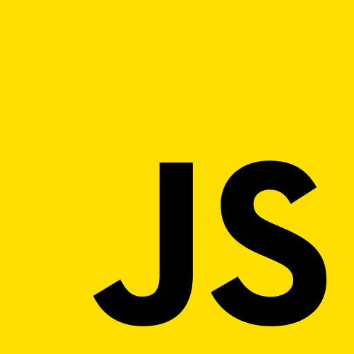
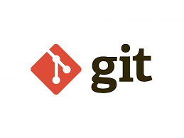

# 👋 Hi there! I'm James Ndungu, a passionate coder and lifelong learner based in Nairobi, Kenya.

## 💻 Skills & Technologies:

- Proficient in HTML, CSS, JavaScript, Python
- Experience with frameworks like Bootstrap, React, and Flask
- Familiar with version control using Git and GitHub
- Comfortable working with SQL databases and RESTful APIs

&nbsp;
&nbsp;
&nbsp;
&nbsp;
&nbsp;
&nbsp;
&nbsp;
&nbsp;

## 🚀 Interests & Projects:

- Currently diving deep into full-stack web development
- Enthusiastic about building responsive and user-friendly interfaces

## 🤝 Open to Collaborations:

- Excited to collaborate on innovative projects and contribute to open-source initiatives
- Always looking to connect with fellow developers and expand my network

## 📫 Let's Connect:

- Check out my [portfolio](https://jimmindungu3.github.io/portfolio/)
- Connect with me on [LinkedIn](https://www.linkedin.com/in/jamesndunguthedev/)
- Check out my [YouTube Channel](https://youtube.com/@DevsToday) for latest and educative tech content.
- Send me an email at jamesthesuperdev@gmail.com for any inquiries or collaboration opportunities

## 😀 Happy coding! 💻✨

